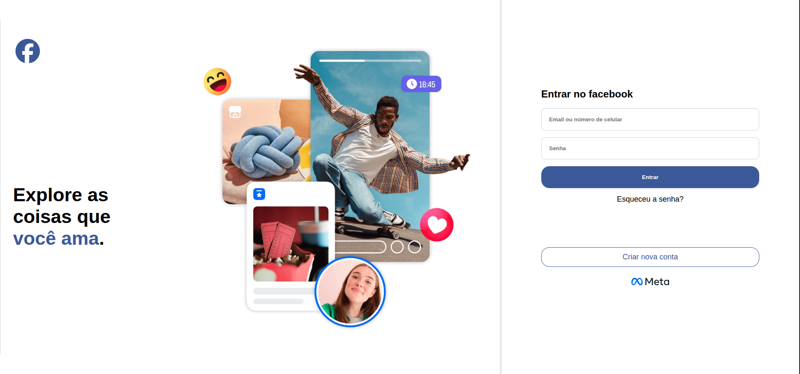
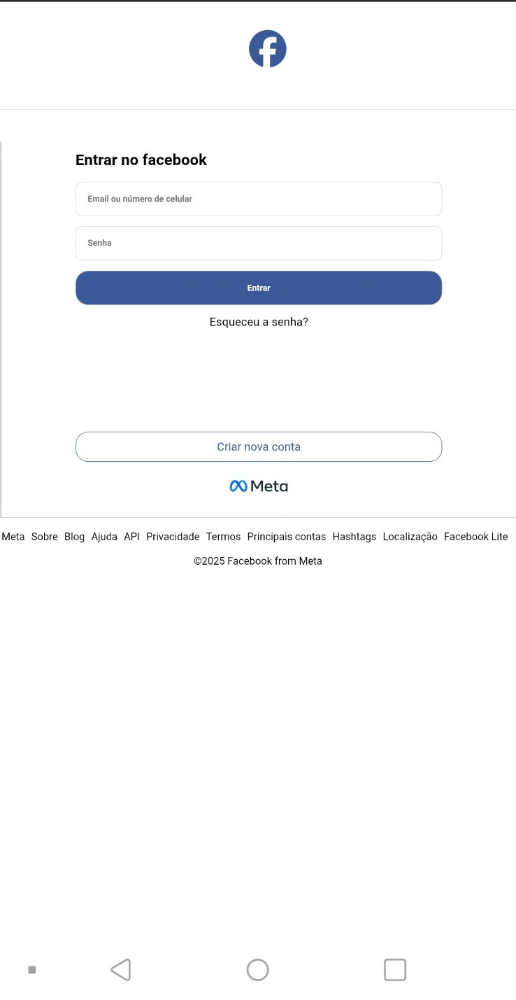

# Clone da Página de Login - Facebook (Estudo de Responsividade)

Este projeto é um clone da página de login do Facebook, desenvolvido com o objetivo de praticar conceitos avançados de **HTML5** e **CSS3**, com foco total em **Flexbox** e **Design Responsivo**.

O desenvolvimento foi guiado por uma metodologia de aprendizado ativo, focando em resolução de problemas e ajustes finos de layout sem o uso de frameworks.

## 🚀 Demonstração

*Desktop vs Mobile*

### Desktop 

### Mobile

## 🛠️ Tecnologias Utilizadas

* **HTML5:** Estruturação semântica (tags `main`, `footer`, `section`).
* **CSS3:** * **Flexbox:** Utilizado para centralização total e distribuição de elementos.
    * **Media Queries:** Implementadas para garantir a fluidez entre 1200px, 768px e 480px.
    * **Sticky Footer:** Técnica para manter o rodapé sempre na base da página.
    * **Variáveis e Unidades Relativas:** Uso de `vh`, `rem` e `%` para adaptabilidade.

## 🧠 Desafios e Aprendizados

Durante o desenvolvimento, foquei em resolver problemas reais de front-end:

* **Centralização Complexa:** Como manter o formulário e o banner alinhados perfeitamente no centro da tela usando `min-height: 100vh`.
* **Transição de Layout (Row to Column):** Ajuste do `flex-direction` para que o banner e o formulário se empilhem corretamente em dispositivos móveis.
* **Ajuste Fino de Imagens:** Uso de `display: none` e redimensionamento de logos para melhorar a experiência em telas menores (480px).
* **Organização do Rodapé:** Uso de `flex-wrap` para evitar que os links do footer quebrem o layout em telas estreitas.

## 📱 Responsividade

O projeto foi testado e otimizado para os seguintes breakpoints:
* **Desktop (>1200px):** Layout original lado a lado.
* **Tablet (768px):** Ajuste de margens e escala de fontes.
* **Mobile (480px):** Layout em coluna, focado em usabilidade e toque.

## ✒️ Autor

* **Kauet Dias** - [Seu GitHub](https://github.com/Kuet1)
---